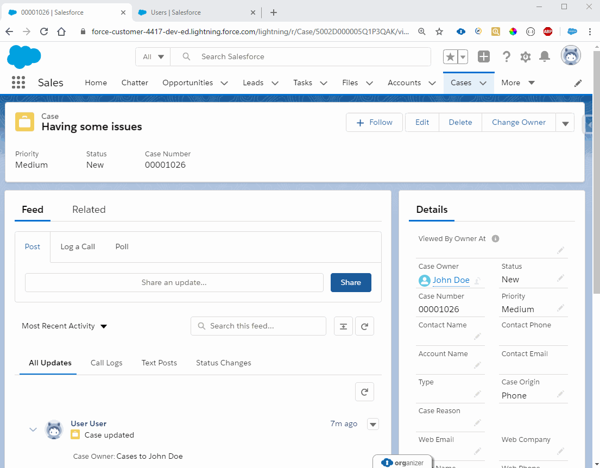
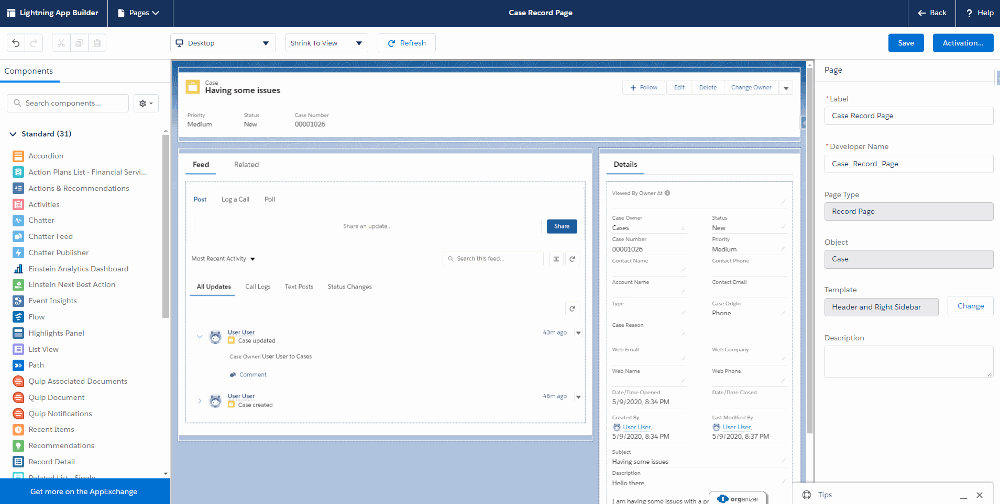

# Record Viewed Demonstration

This project is a demonstration of how to automatically stamp the date/time of when the owner of a Salesforce record initially views that record. This would particularly useful or important for a service manager who would like to know what is the time between when a user initially opens a case record and when they change the status to "Working" or "In Progress" etc. This component is built to be dynamic, so you can use it on any sObject.




## Lightning Web Component

The majority of the work in this project is completed by a Lightning Web Component called `RecordViewedStamp`. The HTML for this component is empty, so it will not be visible to the end users. When an administrator drags this component onto a Lightning Record Page, it uses a dynamic picklist to display the list of updateable date/time fields on the particular object they are viewing. This selected field is where the date/time will be stamped when the owner of a record initially views it.

This Lightning Web Component has a few responsibilities:

1. The LWC must read the passed in target date/time field as specified by the System Administrator who added the component to a record page.

2. The LWC must dynamically fetch the ownerId and the value for the target date/time field for the particular record the user is viewing. To perform this we will use the `getRecord` service with the `optionalFields` parameter - this allows for dynamic runtime definition of the fields requested for the object.

3. If the owner is the current user and the date/time has not yet been set it must update that time to now. To perform this we will use the `updateRecord` service. 

4. Finally, if an update has been made, the component must force the page to refresh in order to prevent the "this record has already been modified" message from popping up when the user saves their record edits. We will use the hacky `eval("$A.get('e.force:refreshView').fire();");` to force this to occur but for a more robust way to refresh Lightning Web Components and have them play nicely with other Aura Components on your page, check out my [LWC Refresh Demonstration Project](https://github.com/mitchspano/LWCRefreshDemo)


```javascript
import { LightningElement, wire, api, track } from 'lwc';
import { getRecord, updateRecord } from 'lightning/uiRecordApi';
import Id from '@salesforce/user/Id';


export default class RecordViewedStamp extends LightningElement {
    @api recordId;
    @api objectApiName;
    @api targetDateTimeField;
    @track _myFields;
    _userId = Id;
    _wiredResponse;

    connectedCallback() {
        if (this.targetDateTimeField && this.objectApiName) {
            this._myFields = [];
            this._myFields.push(this.objectApiName + '.' + this.targetDateTimeField);
            this._myFields.push(this.objectApiName + '.OwnerId');
        }
    }

    @wire(getRecord, {recordId : '$recordId', optionalFields : '$_myFields'})
    wiredRecord(response) {
        this._wiredResponse = response;
        if (response.error) {
            let message = 'Unknown Error';
            if (Array.isArray(response.error.body)) {
                message = response.error.body.map((e) => e.message).join(', ');
            } else if (typeof response.error.body.message === 'string') {
                message = response.error.body.message;
            }
            console.log('Error while trying to get the current owner and viewed date/time : ' + message);
        } else if (response.data) {
            let owner;
            let viewedDateTime;
            if (response.data && response.data.fields && response.data.fields.OwnerId &&response.data.fields.OwnerId.value) {
                owner = response.data.fields.OwnerId.value;
            }
            if (response.data && response.data.fields && response.data.fields[this.targetDateTimeField] &&response.data.fields[this.targetDateTimeField].value) {
                viewedDateTime = response.data.fields[this.targetDateTimeField].value;
            }
            if (!viewedDateTime && (this._userId === owner)) {
                this.setViewedDateTime();
            }
        }

    }


    setViewedDateTime() {
        let fields = {};
        fields['Id'] = this.recordId;
        fields[this.targetDateTimeField] = new Date().toISOString();
        let input = { fields };
        updateRecord(input)
        .then(() => {
            eval("$A.get('e.force:refreshView').fire();");
        })
        .catch(error => {
            console.log('Error while trying to set the Viewed Date/Time');
        })
    }

}
```


## Apex

There is very minimal apex included in this project. The only class we have is the `RecordViewedStampOptions` class which dynamically populates a dynamic picklist to display the list of updateable date/time fields on the particular object they are viewing.



```java
public class RecordViewedStampOptions extends VisualEditor.DynamicPicklist {

    VisualEditor.DesignTimePageContext context;

    public RecordViewedStampOptions(VisualEditor.DesignTimePageContext context) {
        this.context = context;
    }

    public override VisualEditor.DataRow getDefaultValue() {
        VisualEditor.DataRow returnValue = new VisualEditor.DataRow('none', 'NONE');
        return returnValue;
    }
    
    public override VisualEditor.DynamicPicklistRows getValues() {
        VisualEditor.DynamicPicklistRows returnValue = new VisualEditor.DynamicPicklistRows();
        sObjectType mysObjectType = Schema.getGlobalDescribe().get(this.context.entityName);
        Map<String, Schema.sObjectField> fields = mysObjectType.getDescribe().fields.getMap();
        for (Schema.sObjectField field : fields.values()) {
            if (field.getDescribe().isUpdateable() && String.valueOf(field.getDescribe().getType()).equals('DATETIME')) {
                returnValue.addRow(new VisualEditor.DataRow(field.getDescribe().getName(), field.getDescribe().getName()));
            }
        }
        return returnValue;
    }
}


```

## Room for Improvement
There are a few opportunities to improve this component:
* As mentioned before, there are better ways to refresh Lightning Web Components
* This approach does not work if the sObject does not have an Owner. So if the object is on the detail side of a Master-Detail relationship, it will not work.
* Right now we are just logging the error messages to the console. More robust error handling would be nice to add.
* It would be wise to also implement a trigger action before update when the OwnerId is changed to set the date/time field back to null.